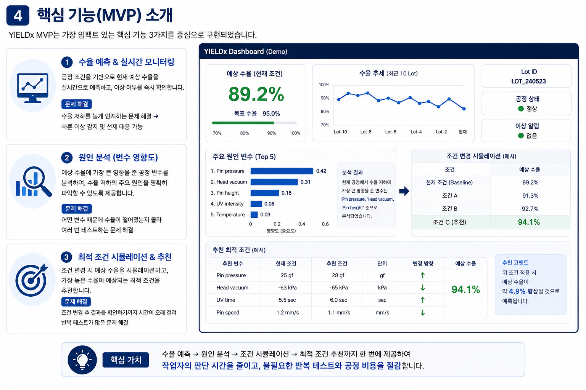
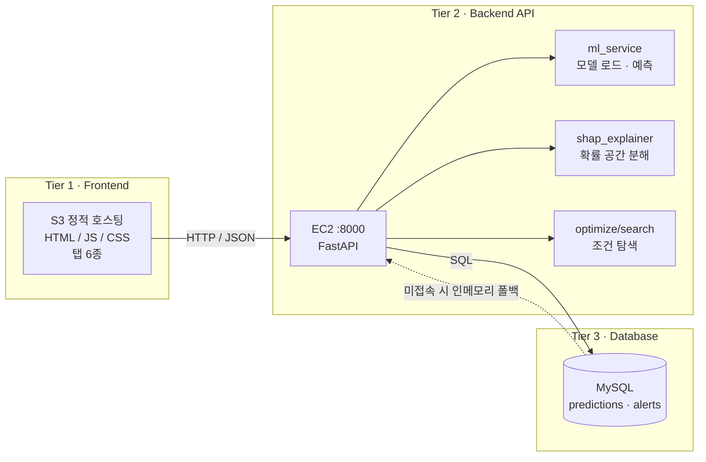

# Yield X

**반도체 후공정 다이 픽업 공정의 수율을 예측하고, 실패 원인을 변수 단위로 분해하며, 조정 가능한 조건만으로 개선안을 제안하는 수율 분석 시스템.**

[](https://github.com/nxtcloud-edu/2026-summer-ai-ht-team07)
[](#2-문제-정의)
[](#1-팀-소개)


---

> ### ⚠️ 데이터 고지 — 반드시 먼저 읽어 주십시오
>
> **이 프로젝트의 학습 데이터는 전부 합성(synthetic) 데이터다. 실제 기업·설비에서 수집한 데이터가 아니다.**
>
> 반도체 후공정 레시피 파라미터는 기밀이라 공개 데이터셋이 존재하지 않는다. 그래서 공개 문헌과
> 설비 사양서로 변수와 정상 운전 범위를 잡고, 반도체 후공정 30년 이상 현직자 면담으로 각 변수의
> 물리적 방향과 상호작용을 정의해 데이터를 생성했다. 변수별 근거는
> [`docs/PHYSICS_RATIONALE.md`](docs/PHYSICS_RATIONALE.md)에 기록되어 있다.
>
> 따라서 이 문서의 모든 성능 수치는 **합성 데이터 안에서 측정된 값**이며, 실제 공정의 수율 개선을
> 보장하지 않는다. 우리가 검증받고자 하는 것은 절대 성능 수치가 아니라 **공정 물리를 모델 제약으로
> 주입하고, 실패 원인을 변수 단위로 분해하고, 조정 가능한 변수만으로 개선안을 만드는 파이프라인이
> 작동하는가**이다.

---

## 목차

- [1. 팀 소개](#1-팀-소개)
- [2. 문제 정의](#2-문제-정의)
- [3. 솔루션 개요](#3-솔루션-개요)
- [4. 핵심 기능](#4-핵심-기능)
- [5. 차별점](#5-차별점)
- [6. 기대 효과](#6-기대-효과)
- [7. 향후 계획](#7-향후-계획)
- [시스템 아키텍처](#시스템-아키텍처)
- [빠른 시작](#빠른-시작)
- [프로젝트 구조](#프로젝트-구조)
- [데이터 카드 요약](#데이터-카드-요약)
- [모델 성능](#모델-성능)
- [한계와 리스크](#한계와-리스크)
- [참고 문헌](#참고-문헌)
- [문서 · 라이선스](#문서--라이선스)

---

## 1. 팀 소개

**팀명 Yield X** · 팀장 이진호(전자공학과)

2026 앵커(ANCHOR) 사업단 SUMMER AI 해커톤 (2026.08.10~11, 1박 2일) · 경기도 용인 HL 인재연수원 ·
주관 서울과학기술대학교 앵커사업단 (컨소시엄: 서울과기대·금오공대·한밭대·아주대) · **트랙 1 산업현장**

| 코드 | 이름 | 전공 | 담당 영역 |
|---|---|---|---|
| A | 이현서 | 전자공학과 | 공정 물리 정의 · 데이터 검수 (변수별 물리 근거, 생성 파라미터 소유) |
| B | 장서희 | 전기정보공학과 | DB · 인프라 · 방어 논리 (MySQL 스키마, 배포 설계, 아키텍처 문서) |
| C | 정재성 | 인공지능소프트웨어학과 | 데이터 · 모델 · ML 서비스 (생성기 구현, 4종 모델 비교, 모델 서비스 레이어) |
| D | 김보연 | 인공지능학과 | API 라우터 · 설명 · 최적화 (FastAPI 라우터, SHAP 분해, 조건 탐색) |
| E | 이진호 | 컴퓨터공학과 | 프론트엔드 · 통합 · 데모 (정적 프론트엔드, 앱 초기화, 안정화) |

이 주제는 모델 성능보다 **그 변수 방향이 물리적으로 맞는가**가 신뢰를 좌우한다.
하드웨어 전공자 두 명(A·B)이 공정 물리 근거와 시스템 설계를 맡고 AI/SW 세 명이 구현을 맡은 구성이,
"데이터로만 학습한 결과"가 아니라 "공정 물리를 제약으로 넣은 결과"라는 이 프로젝트의 핵심 주장을
뒷받침한다.

역할별 파일 소유권과 완료 정의는 [`ROLES.md`](ROLES.md)에 있다.

---

## 2. 문제 정의

### 다이 픽업 공정이란

웨이퍼를 절단해 만든 개별 칩(다이)을 다이싱 테이프에서 떼어내 다음 공정으로 옮기는 공정이다.
아래 세 가지가 동시에 맞아야 한 개의 다이가 성공적으로 픽업된다.

```
        [픽업 헤드 / 콜릿]  ← 진공으로 다이를 흡착
              ↓ 흡착
        ┌───────────┐
        │    다이     │        ← 얇을수록 크랙에 취약 (100~150 µm)
        └───────────┘
        ═══════════════       ← 다이싱 테이프 (UV 조사로 점착력 저하)
              ↑ 밀어올림
        [이젝터 핀]           ← 압력·속도·높이가 크랙을 좌우
```

1. 테이프 점착력이 충분히 낮아야 한다 (UV 조사 시간·광량)
2. 이젝터 핀이 다이를 깨지 않고 들어올려야 한다 (압력·속도·높이 × 다이 두께)
3. 픽업 헤드가 다이를 놓치지 않아야 한다 (진공압)

이 조건들은 서로 **상호작용**한다. 얇은 다이에 핀을 빠르게 올리면 크랙이 나지만 두꺼운 다이에서는
같은 속도가 문제되지 않는다. 변수 하나만 봐서는 원인을 찾을 수 없는 이유다.

### 우리가 푸는 문제 세 가지

**(a) 실패 원인을 변수 단위로 알 수 없다.**
설비는 성공·실패 결과만 남기고, 13개 조건 중 무엇이 결과를 갈랐는지는 알려주지 않는다.
상호작용이 있는 구간에서는 단일 변수 임계값 관리로 원인을 특정할 수 없다.

**(b) 조건 탐색이 숙련자 경험에 의존한다.**
실패가 나면 숙련자가 경험으로 조건을 바꾸고 결과를 기다린다. 시행착오 한 사이클마다 비용이 들고,
숙련자와 신입의 판단 폭이 크게 다르다.

**(c) 중소 OSAT는 자체 AI 인력이 없다.**
후공정은 중소·중견기업이 다수인 영역이다. 데이터를 쌓으려면 시스템이 먼저 있어야 하는데,
AI를 도입하려면 라벨링된 데이터가 먼저 필요하다는 순환에 갇혀 있다.

### 근거

- 반도체 후공정 전문가 자료 기반  — 변수 선정, 정상 운전 범위, 물리적 방향, 상호작용 정의
- 정은혜 외, "데이터마이닝을 활용한 반도체 공정 수율 향상 방안에 관한 연구",
  한국품질경영학회지 47(4), 2019, pp.725–739 — 유의미한 변수 3~5개를 선별해 개선 권고안을
  제시하는 방식으로 **약 2.1% 수율 향상**을 보고했다. 변수 선별 후 조건 개선이라는 접근이
  현업에서 성과를 낸 사례다.

### 트랙 1과의 연결

트랙 1의 과제는 제조업·산업단지·중소기업의 생산성 및 안전 향상이다.
후공정 OSAT는 국내에 중소·중견기업이 다수 존재하는 영역이고, 이들은 AI 인력이 부족해 자체 개발이
어렵다. 전공정 대상 AI 수율 솔루션은 대기업 시장을 중심으로 이미 존재하지만 후공정 다이 픽업에
대한 AI 최적화 시도는 드물다. 그리고 수율은 반도체 공정 수익성을 직접 좌우하는 지표라,
개선이 곧 생산성 향상으로 환산된다.

---

## 3. 솔루션 개요

**Yield X는 "왜 이 다이가 실패했는지 변수 단위로 알 수 없다"는 문제를, 공정 물리를 제약으로 주입한
예측 모델과 조정 가능 변수만을 대상으로 한 조건 탐색으로 해결한다.**



*하나의 화면에서 예상 수율 · 실패 원인 변수 · 개선 조건까지 이어지도록 설계한 기획 시안이다.
화면에 적힌 숫자는 레이아웃 설명용 예시이며, 검증된 측정값은 [모델 성능](#모델-성능) 절에 있다.*

### 4단계 파이프라인

```
① 예측          13개 공정 변수  →  픽업 성공 확률 + 위험 등급
      ↓
② 원인 분해     SHAP 기여도     →  "어떤 변수가 성공률을 몇 %p 깎았는가"
      ↓
③ 조건 제안     조건 탐색       →  "조정 가능한 변수를 얼마로 바꾸면 몇 %p 오르는가"
      ↓
④ 알림          임계값 초과 시  →  담당자에게 메일 (기본 dry-run)
```

각 단계는 독립된 API 엔드포인트로 노출되고, 프론트엔드의 탭이 각 단계에 대응한다.
모델 파일이 없어도 서버와 화면은 mock 모드로 동작하며, `is_mock` 값이 화면과
`/api/health`에 항상 노출되어 모의 결과를 실제 결과로 착각할 수 없게 했다.

---

## 4. 핵심 기능

<!-- TODO: 아래 3개 기능의 실제 화면 스크린샷을 docs/ 에 추가하고 이 자리에 삽입할 것.
     현재 리포지토리에 커밋된 이미지는 기획 시안 1장뿐이다. -->

### 기능 1 — 수율 예측

<!-- TODO: docs/screenshot_predict.png (예측 탭 화면) -->

13개 공정 변수를 입력하면 픽업 성공 확률과 위험 등급을 반환한다.
위험 등급은 `configs/app.yaml`의 임계값을 따라 60% 미만이면 critical, 80% 미만이면 warning이다.
단건 예측(`POST /api/predict`)과 CSV 다건 예측(`POST /api/predict/batch`)을 모두 지원한다.

**푸는 문제**: (b) 조건을 바꿔 실제로 돌려 보기 전에 결과를 미리 확인할 수 있다.

**검증**: 홀드아웃 1,600건에서 실제 수율 67.44%, 모델 평균 예측 수율 67.16%로 차이가 **-0.28%p**였다.
확률을 수율로 표시하는 제품이므로 이 보정 정확도가 정확도보다 중요하다.

### 기능 2 — SHAP 원인 분해

<!-- TODO: docs/screenshot_explain.png (원인 분석 탭 화면) -->

개별 다이 한 건에 대해 어떤 변수가 예측 확률을 얼마나 올리고 내렸는지 분해한다.
`shap.TreeExplainer`를 **확률 공간(`model_output="probability"`)에서** 계산하기 때문에 기여도가
로그 오즈가 아니라 **확률 퍼센트포인트(%p)** 단위로 나온다. 실무자에게 "-0.83"이 아니라
"이 변수가 성공률을 12%p 깎았습니다"라고 말할 수 있다.

**푸는 문제**: (a) 결과만 남던 실패에 변수 단위 설명이 붙는다.

> **한계 — 같은 자리에서 밝힌다.** SHAP은 **상관 기반 설명이지 인과 추정이 아니다.**
> 학습된 모델이 이 예측을 어떻게 분해했는지를 보여줄 뿐, 그 변수를 실제로 바꿨을 때의 개입 효과가
> 아니다. 이 프로젝트에서 SHAP은 **개선 후보 변수를 좁히는 용도**로만 쓰며, 실제 개선 폭은 현장
> PoC로 검증해야 한다. 이 고지 문구는 코드 상수로 박혀 API 응답과 화면에 그대로 노출된다.

참고로 permutation ablation 기준 모델이 가장 크게 의존하는 변수는 UV 조사 시간(PR-AUC 감소
0.0472), 픽업 헤드 진공압(0.0264), 핀 상승 높이(0.0245) 순이다. 이 순위 역시 모델이 사용한
정보량이지 인과 효과 순위가 아니다.

### 기능 3 — 조건 최적화 가이드

<!-- TODO: docs/screenshot_optimize.png (가이드 탭 화면) -->

학습된 모델의 예측만으로 조건을 탐색해 "무엇을 얼마로 바꾸면 몇 %p 오르는가"를 제안한다.
탐색 전략은 기본이 좌표 하강이며 결정론적이라 같은 입력에 항상 같은 답이 나온다.

이 기능의 핵심은 성능이 아니라 **무엇을 제안하지 않는가**에 있다.

- **조정 불가 변수 4개를 스키마 수준에서 제외한다.** `die_thickness`(제품 사양),
  `tape_type`(자재), `runtime_hours`·`vacuum_status`(설비 상태)는 탐색 공간에 아예 들어가지 않는다.
  "다이를 두껍게 하세요"는 "제품을 바꾸세요"와 같은 말이고, 그 제안이 나오는 순간 실무자 신뢰를
  잃는다. 설정으로 껐다 켜는 것이 아니라 `schema.ADJUSTABLE`에서 구조적으로 차단되어 있고,
  `tests/test_optimize.py::test_fixed_features_never_change`가 이를 강제한다.
- **현장 수용성 제약**을 건다. 각 변수는 허용 범위 폭의 18%까지만 움직이고, 동시에 바꾸는 변수는
  3개 이하이며, 제안값은 설비가 실제로 설정할 수 있는 분해능으로 맞춰 나간다.
  개선 폭이 0.5%p 미만이면 제안하지 않고 "이미 양호한 설정"으로 표시한다.

**푸는 문제**: (b) 숙련자 경험에 의존하던 조건 탐색에 재현 가능한 출발점이 생긴다.

**시나리오 — 데모 프리셋 "얇은 다이 + 빠른 핀"**
정상 조건에서 다이 두께와 핀 속도만 바뀐 케이스다. 단일 변수만 보면 원인을 찾기 어렵다.

| 항목 | 값 |
|---|---|
| 현재 조건의 모델 예측 | 21.25% |
| 제안 조건의 모델 예측 | 88.48% |
| 바꾼 변수 | `uv_time`, `pin_speed`, `head_vacuum` (3개) |
| 바꾸지 않은 변수 | `die_thickness` 등 조정 불가 4종 — 원인이지만 제안 대상이 아니다 |

조정 불가 변수가 원인일 때는 레시피 최적화로 일부만 회복된다. 프리셋 "마모 + 약한 진공"은
모델 예측이 40.32% → 91.53%로 오르지만, 생성기의 참확률로 사후 확인하면 16.80% → 74.49%에
그친다. **설비 상태가 나쁜 조건에서는 조건 제안을 그대로 적용하면 안 된다**는 한계를 그대로
드러내는 사례이고, 이 경우 제품이 해야 할 일은 조건 변경이 아니라 콜릿 교체·설비 보전 안내다.

### 기능 4 — 임계값 알림

성공 확률이 critical 등급으로 떨어지면 담당자에게 메일을 보낸다. 같은 다이에 반복 발송하지 않도록
쿨다운(기본 300초)을 두었고, 본문에는 무엇이 문제인지·왜 그런지·무엇을 하면 되는지 세 가지와 함께
SHAP 한계 및 합성 데이터 고지가 들어간다. 기본 설정은 dry-run이라 본문만 반환하고 실제 발송은
옵션이다.

**푸는 문제**: 다이 픽업은 실무자가 화면 앞에 앉아 있는 공정이 아니다. 임계값을 넘는 순간 사람을
불러오는 것이 알림의 역할이다.

---

## 5. 차별점

| 비교 대상 | 그쪽의 접근 | Yield X |
|---|---|---|
| 전공정 AI 수율 예측 (샌드박스 세미컨덕터 등) | 대기업 전공정 팹 대상, 데이터 기반 수율 예측 | 중소·중견 **후공정 다이 픽업** 대상, 변수 단위 원인 분해 + 조정 가능 변수만의 개선 조건 |
| 숙련자 경험 기반 조건 조정 | 사람의 경험으로 조건을 바꾸고 결과를 기다림 | 재현 가능한 탐색으로 후보를 좁히고, 물리 제약과 이동 폭 제한으로 비현실적 제안을 차단 |
| 일반적인 반도체 AI 프로젝트 | 성능 지표 중심, 예측까지 | 예측 → 원인 분해 → 조건 제안까지 하나의 파이프라인, 그리고 그 결과의 **한계를 코드와 문서에 명시** |

### 기술적 차별점 3가지

**1) 생성 규칙과 최적화 가이드 사이의 방화벽**

합성 데이터 프로젝트의 진짜 위험은 데이터가 가짜라는 점이 아니라 **정답을 넣고 그 정답을 다시
꺼내는 순환 논리**다. Yield X는 `src/yeda/optimize/`와 `src/yeda/explain/`이 생성 규칙인
`src/yeda/data/physics.py`를 import하는 것 자체를 금지했고,
`tests/test_contracts.py::test_no_generator_leak`이 이를 자동으로 강제한다.
개선 가이드는 오직 학습된 모델의 예측만으로 유도된다. 구조적으로 커닝이 불가능하다.

**2) 단조 제약(monotone constraints)으로 공정 물리를 모델에 주입**

현직자 공식 자료를 기반으로 방향이 확정된 변수에 LightGBM의 `monotone_constraints`를 걸었다.
13개 중 10개에 방향을 고정했고, 내부 최적점이 있어 방향을 하나로 정할 수 없는 `pin_height`·
`temperature`와 범주형인 `tape_type` 3개는 제약을 걸지 않았다.

| 변수 | 제약 | 물리적 근거 |
|---|---|---|
| `uv_time`, `uv_intensity` | +1 | UV 조사 → 점착제 경화 → 이형 용이 |
| `pin_pressure` | +1 | 박리 구동력 증가 |
| `die_thickness` | +1 | 굽힘 강성 증가 → 크랙 저항 |
| `pin_speed` | −1 | 빠를수록 굽힘 응력 증가 → 크랙 |
| `head_vacuum`, `pin_vacuum`, `vacuum_status` | −1 | **음수 게이지압**: 값이 작을수록(더 음수) 진공이 강하다 |
| `humidity` | −1 | 계면 수분 → 미세 슬립 |
| `runtime_hours` | −1 | 콜릿 마모 누적 |
| `pin_height`, `temperature` | 0 | 내부 최적점 존재 (약 0.50 mm / 약 24 °C) |
| `tape_type` | 0 | 범주형(0/1) — 방향 개념이 없음 |

효과는 두 가지다. 정확도가 0.849에서 **0.854**로, ECE가 0.0426에서 **0.0267**로 함께 좋아졌다.
그리고 더 중요하게는, 데이터에 우연히 섞인 노이즈 때문에 모델이 "진공을 약하게 하면 성공률이
오릅니다" 같은 물리적으로 불가능한 조언을 내놓는 것을 구조적으로 막는다.
가중치는 데이터가 바뀌면 사라지지만 방향 10개는 남기 때문에, 이것이 실데이터로 그대로 옮길 수
있는 자산이다.

**3) 확률 보정(calibration) 검증**

화면에 "예상 수율 82%"를 띄우려면 82%라고 예측한 케이스가 실제로 82% 성공해야 한다.
본선 모델의 ECE는 **0.0267**이고, 확률 구간별 예측과 실제를 대조한
[`calibration_curve.csv`](artifacts/metrics/calibration_curve.csv)로 검증한다.
정확도만 좋고 확률이 어긋난 모델은 이 제품에서 쓸 수 없다.

### 데이터 생성 방법론

초기 데이터는 부등식 4개의 결정론적 AND 조합으로 라벨이 만들어져서, **5,000행 전부가 그 규칙으로
재현되었고 정확도가 99.86%로** 나왔다. 13개 변수 중 9개는 타겟과의 상관이 −0.03~0.01인 순수
난수였다. 모델이 학습한 것은 공정 물리가 아니라 부등식 4개였고, 99.86%는 성능이 아니라 규칙을
되읽은 값이었다.

우리는 이 결함을 직접 찾아 **생성기를 전면 폐기하고 확률적 라벨 생성기로 교체했다.**
잠재 점수를 확률로 바꾼 뒤 베르누이 샘플링으로 라벨을 뽑기 때문에 같은 조건에서도 결과가 갈리고,
그 결과 **이론적 최대 정확도(베이즈 정확도)가 0.870으로 내려가 100%가 나올 수 없는 구조**가 되었다.
정확도는 99.86%에서 0.854로 내려갔다.

그리고 같은 실패로 되돌아가지 못하도록 회귀 테스트를 붙였다.
`test_label_is_not_deterministic`은 베이즈 정확도가 0.95를 넘으면 실패하고,
`test_no_single_rule_reproduces_target`은 어떤 단일 임계값 규칙이 90% 이상을 재현하면 실패하며,
`test_all_features_contribute`는 순수 난수 변수가 하나라도 있으면 실패한다.

**성능을 자랑하는 대신 성능이 가짜였다는 것을 스스로 증명하고 고친 과정이 이 프로젝트에서
가장 중요한 대목이다.** 99.86%를 그대로 발표하는 것이 훨씬 쉬웠지만, 그 숫자는 아무것도 뜻하지
않았다.

---

## 6. 기대 효과

각 항목의 근거 등급을 표시한다. 등급이 다른 항목을 나란히 놓고 같은 무게로 읽지 않도록 한다.

### 검증됨 — 이번 실험에서 측정된 값 (모두 합성 데이터 한정)

| 항목 | 측정값 | 단서 |
|---|---|---|
| 수율 예측 정확도 | 본선 모델 PR-AUC 0.9436, recall 0.9333 | 홀드아웃 1,600건 |
| 확률 보정 | ECE 0.0267, 배치 수율 예측 오차 -0.28%p | 실제 67.44% vs 예측 67.16% |
| 조건 제안 감사 | 사후 oracle 기대수율 68.47% → **86.98%** (+18.51%p, 95% bootstrap CI +15.71~+21.37%p), 악화 관측 **0/200** | **합성 데이터 내부의 사후 감사 결과이며 현장 수율 보장치가 아니다.** 모델 선택·학습·후보 생성에 사용하지 않은 생성기 참확률로, 모든 추천을 동결한 뒤 계산했다 |
| 물리 방향 일관성 | 단조 제약 10개 전부 grid 검증 통과 | `make train` 실행 시 자동 검증 |
| 회귀 테스트 | **91개 전부 통과** | `PYTHONPATH=src pytest tests` |

### 문헌 근거

정은혜 외(2019)는 유의미한 변수 3~5개를 선별해 개선 권고안을 제시하는 방식으로 **약 2.1%의
수율 향상**을 보고했다. 변수 선별 후 조건 개선이라는 접근이 현업에서 성과를 낸 근거로 인용하며,
**이 2.1%는 해당 연구의 결과이지 Yield X가 달성한 값이 아니다.**

### 정성적 기대 — 아직 측정하지 않았다

- **작업자 편차 감소** — 조건 판단의 출발점이 사람마다 다르지 않고 같은 근거에서 시작한다.
- **신입과 숙련자의 격차 완화** — 어떤 변수를 먼저 볼지에 대한 설명이 화면에 남는다.
- **하드웨어 교체 없는 도입** — 설비를 바꾸지 않고 이미 나오는 조건값과 결과만으로 분석한다.
- **데이터 반출 없는 로컬 분석** — 3-Tier 구성 그대로 고객사 내부에 배치할 수 있다.

> 금액 환산(연간 N억원 등)은 생산량·다이 단가 가정 없이는 의미가 없어 이 문서에 넣지 않았다.

---

## 7. 향후 계획

**1단계 — 현장 PoC 검증.**
추천 조건을 실제 설비에 적용해 개선 효과를 측정한다. 우선 30일 정도는 개입 없이 예측만 하면서
실제 픽업 결과와 대조하고, 보정 곡선으로 확률이 믿을 만한지 확인한 뒤 조건 적용으로 넘어간다.
실데이터로 재학습했을 때 단조 제약 10개의 방향이 그대로 유지되는지가 첫 번째 검증 항목이다.

**2단계 — 실측 센서 연동.**
현재는 조건을 사람이 입력한다. OPC UA 기반 수집으로 설비에서 직접 받아오는 구조를 설계했다
(arXiv:2310.17052 참조). 이때의 실제 과제는 프로토콜이 아니라 **취득 주기가 다른 값을 다이 단위로
조인하는 것**이다. UV 시간·핀 높이 같은 레시피 파라미터는 로트 단위로 고정이고 진공압·온도 같은
센서값은 실시간이다.

**3단계 — 설비별 전이학습.**
현재 모델은 단일 설비를 가정한다. 설비 ID를 변수로 추가하고, 설비마다 다른 편차를 전이학습으로
흡수하는 구조로 확장한다.

**4단계 — 다품종 확장.**
다이 두께·테이프 종류 조합이 늘어나는 다품종 소량 생산 환경에서 조건 추천을 유지하는 것이 목표다.

### SECOM 일반화 검증 (보조)

파이프라인이 합성 데이터에서만 도는 것이 아님을 보이기 위해 UCI SECOM(실측 반도체 팹 센서 데이터,
1,567행 × 590특성, 불량률 약 6.6%) 검증 모듈을 `src/yeda/secom/`에 분리해 두었다.
**SECOM은 590개 특성이 전부 익명이라 물리적 의미를 알 수 없으므로 조건 최적화 가이드를 적용하지
않는다.** 의미를 모르는 변수에 "이 값을 이렇게 바꾸세요"라고 조언할 수 없기 때문이며,
전처리·학습·평가 파이프라인의 일반화 검증으로만 범위를 제한한 의도된 선택이다.

<!-- TODO: SECOM 실행 결과 수치. 현재 data/external/ 에 원본이 없어 `make secom-data`
     실행 전이며, 실행 결과가 나오면 이 자리에 PR-AUC·recall을 기재할 것. -->

---

## 시스템 아키텍처



*계층을 나눈 이유는 세 가지다. 예측 이력이 서버 재시작 후에도 남아야 해서 DB를 분리했고,
백엔드가 멈춰도 화면은 떠야 해서 프론트엔드를 정적 호스팅으로 분리했으며,
DB 자격증명이 프론트엔드에 노출되면 안 되기 때문에 서버 내부 환경변수로만 주입한다.*

| 계층 | 기술 | 역할 | 주 담당 |
|---|---|---|---|
| Tier 1 | S3 정적 호스팅 (HTML/JS/CSS) | 입력 화면, 결과 시각화, 탭 전환 | E |
| Tier 2 | EC2 · FastAPI (포트 8000) | 예측·설명·최적화·알림 API, 모델 서비스 | D(라우터) + C(ML) |
| Tier 3 | MySQL | 예측 이력, 알림 이력 저장 | B |

### API 엔드포인트

| Method | Path | 설명 |
|---|---|---|
| GET | `/api/health` | 헬스체크 — 모델 로드 상태와 `is_mock` 반환 |
| GET | `/api/presets` | 데모 프리셋 목록 (`configs/app.yaml`) |
| POST | `/api/predict` | 13개 변수 → 성공 확률 + 위험 등급 |
| POST | `/api/predict/batch` | CSV 다건 벡터화 예측 |
| POST | `/api/explain` | SHAP 기여도 분해 (확률 %p 단위) |
| POST | `/api/optimize` | 조정 가능 변수만의 조건 개선 제안 |
| POST | `/api/alert` | 임계값 알림 트리거 (기본 dry-run) |
| GET | `/api/history` | 예측 이력 조회 |
| GET | `/api/warning` | 수율 저하 조기경보 상태 (현재는 상태 스텁 — 이력 누적 기반 판정은 미구현) |
| POST | `/api/retrain` | 업로드한 CSV를 누적해 **수동 재학습** 실행 후 모델 핫 리로드 |
| POST | `/api/reset-model` | 원본 8,000행 기준 모델로 초기화 |

> `/api/retrain`은 사용자가 명시적으로 호출할 때만 도는 수동 재학습이다.
> 자동 온라인 학습이나 자가 최적화가 아니다.

프론트엔드 탭은 대시보드 · 예측 · 원인 분석 · 가이드 · 알림 · 이력&경보 6종이다.

---

## 빠른 시작

```bash
# 1. 의존성 설치
make setup

# 2. 합성 데이터 생성 (시드 20260810 고정 — 언제 돌려도 같은 데이터)
make data

# 3. 모델 4종 학습·비교 후 본선 모델 저장
make train

# 4. 데모 실행
make demo
```

3-Tier 구성으로 띄우려면 백엔드와 프론트엔드를 각각 실행한다.

```bash
make api        # FastAPI 백엔드 — http://localhost:8000  (API 문서: /docs)
make frontend   # 정적 프론트엔드 — http://localhost:3000
```

| 명령 | 설명 |
|---|---|
| `make check` | 기존 데이터 검수만 수행 (생성하지 않음) |
| `make train-fast` | 교차검증을 생략한 빠른 학습 |
| `make test` | pytest 실행 |
| `make all` | 데이터 → 학습 → 테스트 전체 파이프라인 |
| `make clean` | 생성물 삭제 (설정과 코드는 건드리지 않음) |

모델 파일이 없어도 API와 화면은 mock 모드로 뜬다. `/api/health`의 `is_mock` 값으로 어느 모드인지
항상 확인할 수 있다.

---

## 프로젝트 구조

```
.
├── README.md               이 문서
├── ROLES.md                5명 역할 분담 · 파일 소유권 · 완료 정의
├── TIMELINE.md             마일스톤
├── Makefile                setup / data / train / api / frontend / demo
├── requirements.txt        버전 고정 의존성
├── .env.example            SMTP + DB 설정 예시 (.env 는 커밋 금지)
│
├── frontend/               Tier 1 — S3 정적 호스팅
│   ├── index.html            탭 6종 (대시보드/예측/원인/가이드/알림/이력)
│   ├── js/                   api · app · dashboard · predict · explain · optimize · alert · history
│   └── css/style.css
│
├── api/                    Tier 2 — FastAPI 백엔드 (EC2 :8000)
│   ├── main.py               앱 엔트리포인트 (CORS, health, batch, retrain)
│   ├── routers/              predict · optimize · alert · history
│   ├── models/               Pydantic 요청·응답 스키마
│   ├── services/ml_service.py  모델 로드 · 예측 · SHAP 배경 데이터
│   └── db/                   MySQL 연결 풀과 쿼리 (미접속 시 인메모리 폴백)
│
├── configs/                모든 파라미터를 코드 밖으로
│   ├── data_gen.yaml         공정 물리 계수 · 상호작용 · 노이즈       [소유: A]
│   ├── model.yaml            모델 하이퍼파라미터 · 평가 설정          [소유: C]
│   ├── optimize.yaml         탐색 전략 · 현장 수용성 제약             [소유: D]
│   ├── app.yaml              UI · 알림 · 데모 프리셋                  [소유: E]
│   └── yield_experiment.yaml 조건 추천 사후 감사 설정                 [소유: C]
│
├── src/yeda/               ML 코어 라이브러리
│   ├── schema.py             공용 계약 — 컬럼 · 범위 · 조정가능 · 단조성
│   ├── data/
│   │   ├── physics.py        물리 관계 → 잠재 점수   (생성 전용, 외부 import 금지)
│   │   ├── generator.py      확률적 라벨 생성기
│   │   └── preprocess.py     결측 대치 · 홀드아웃 분리
│   ├── models/               학습 · 평가 · 레지스트리
│   ├── explain/shap_explainer.py   확률 공간 SHAP 분해
│   ├── optimize/search.py    조정 가능 변수 탐색
│   ├── alerts/email.py       임계값 알림 (기본 dry-run)
│   └── secom/pipeline.py     SECOM 일반화 검증 (메인과 완전 분리)
│
├── app/                    레거시 Streamlit UI (1-Tier 참조용)
├── scripts/                make_data · train · analyze_model · run_yield_experiment · init_db.sql · deploy.sh
├── tests/                  계약 · 생성기 · 최적화 · 모델 · API 테스트 (91개)
├── docs/                   물리 근거 · 데이터 카드 · 아키텍처 · 발표 Q&A
├── notebooks/              탐색 전용 (프로덕션 로직 금지)
├── data/raw/               합성 데이터 (시드 고정으로 재생성 가능)
└── artifacts/
    ├── models/               학습된 모델          (gitignore)
    ├── metrics/              비교표 · 보정 곡선 · 감사 결과
    └── figures/              그래프               (gitignore)
```

---

## 데이터 카드 요약

| 항목 | 내용 |
|---|---|
| 종류 | **합성(synthetic) 데이터 — 실제 기업 데이터가 아니다** |
| 규모 | 8,000행 × 13변수 + 타겟 1 |
| 타겟 | `pickup_success` (1 = 픽업 성공, 0 = 실패) |
| 성공률 | 67.4% |
| 베이즈 정확도 상한 | **0.870** — 라벨이 확률적이라 완벽한 모델도 100%를 낼 수 없다 |
| 결측 | 전체 1.8% (변수별 1.5~2.8%, 의도적 삽입) |
| 생성 시드 | 20260810 (고정) |
| 생성 명령 | `make data` |
| 파라미터 | `configs/data_gen.yaml` |

생성 절차는 조건 샘플링(설정점 중심 65% + 범위 균등 35%) → 잠재 점수(13변수 기여 + 상호작용 3개)
→ 확률 변환 → **베르누이 라벨 샘플링** → 센서 노이즈·분해능 반올림 → 결측 삽입 순이다.
라벨이 확률적이라는 점과, 모델이 참값이 아니라 노이즈가 낀 관측값만 본다는 점이 핵심이다.

상세는 [`docs/DATA_CARD.md`](docs/DATA_CARD.md), 변수별 물리 근거는
[`docs/PHYSICS_RATIONALE.md`](docs/PHYSICS_RATIONALE.md)에 있다.

---

## 모델 성능

**평가 원칙: accuracy를 단독으로 앞세우지 않는다.**
이 데이터의 성공률이 67.4%이므로 모든 다이를 "성공"이라고만 찍어도 정확도 67.4%가 나온다.[^1]
그래서 PR-AUC · recall · macro-F1과 확률 보정(ECE)을 함께 본다.

### 홀드아웃 성능 (20%, 시드 고정)

| 모델 | Accuracy | PR-AUC | Recall | macro-F1 | Brier ↓ | ECE ↓ |
|---|---|---|---|---|---|---|
| LogisticRegression (베이스라인) | 0.809 | 0.9017 | 0.8897 | 0.7751 | 0.1339 | 0.0305 |
| RandomForest | 0.832 | 0.9325 | 0.9231 | 0.7973 | 0.1226 | 0.0435 |
| LightGBM (제약 없음) | 0.849 | 0.9415 | 0.9231 | 0.8206 | 0.1134 | 0.0426 |
| **LightGBM + 단조 제약 (본선)** | **0.854** | **0.9436** | **0.9333** | **0.8251** | **0.1088** | **0.0267** |

출처: [`artifacts/metrics/model_comparison.csv`](artifacts/metrics/model_comparison.csv).
교차검증(3-fold OOF) 결과도 유사해서 본선 모델의 OOF PR-AUC는 0.9450이다. 홀드아웃과 OOF 사이에
큰 차이가 없어 과적합 우려가 낮다.

정확도 0.854는 베이즈 정확도 상한 0.870에 가깝다. 남은 0.016은 센서 노이즈·분해능 반올림·결측
1.8%·유한 표본에서 오는 줄일 수 없는 손실이다. **이 데이터에서 99%대가 나온다면 그것은 성능이
아니라 생성기가 잘못됐다는 신호다.**

### 확률 보정

| 항목 | 값 |
|---|---|
| 홀드아웃 실제 수율 | 67.44% |
| 모델 평균 예측 수율 | 67.16% |
| 배치 수준 차이 | **-0.28%p** |
| ECE | **0.0267** |

구간별 대조는 [`artifacts/metrics/calibration_curve.csv`](artifacts/metrics/calibration_curve.csv)에
있다. 단조 제약이 정확도뿐 아니라 ECE를 0.0426에서 0.0267로 절반 수준으로 낮췄다는 점이
이 제품에서는 더 중요하다.

### 조건 추천 사후 감사

모델은 "최적화 후 예상 수율"로 고르지 않았다. 홀드아웃 PR-AUC를 우선하고 Brier를 동률 기준으로
사용해 본선 모델을 먼저 확정했고, 그 뒤 **모든 추천을 동결한 다음** 생성기의 참확률을 사후 감사에만
사용했다.

| 항목 | 값 |
|---|---|
| 대상 | 홀드아웃 200행, 변수 범위 폭의 18% 이내·동시 3개 이하 제약 |
| 모델 예상 수율 | 68.20% → 88.24% (+20.04%p) |
| 사후 oracle 기대수율 | 68.47% → **86.98%** (+18.51%p, 95% bootstrap CI +15.71~+21.37%p) |
| 개선 관측 / 악화 관측 | 89.5% / **0 / 200** |
| 평균 변경 변수 | 2.14개 |

> **이 +18.51%p는 합성 데이터 내부의 사후 감사 결과이며, 현장 수율 보장치가 아니다.**
> 악화 관측 0/200 역시 현장 위험이 0이라는 뜻이 아니다. 조건 추천은 현장 PoC 검증 대상이지
> 자동 적용값이 아니다.

전체 해석과 재생성 방법은 [`artifacts/metrics/README.md`](artifacts/metrics/README.md)에 있다.

### 테스트

```
PYTHONPATH=src pytest tests   →   91 passed
```

계약(`test_contracts.py`) · 생성기(`test_generator.py`) · 최적화(`test_optimize.py`) ·
모델(`test_models_C.py`) · ML 서비스(`test_ml_service_C.py`) · API(`test_api.py`) ·
스키마(`test_schema.py`) · 수율 실험(`test_yield_experiment.py`) 8개 파일로 구성된다.

[^1]: 다수 클래스로만 찍는 기준선 정확도가 0.674다. 즉 accuracy 0.854의 실질적 의미는
      "기준선 대비 +0.18"이며, 이 숫자 하나로 모델의 품질을 말할 수 없다.

---

## 한계와 리스크

숨기지 않고 먼저 밝힌다. 아래는 전부 우리가 인지하고 있는 한계이며, 대부분은 의도적인 범위 제한이다.

| # | 한계 | 영향 | 대응 |
|---|---|---|---|
| 1 | **합성 데이터 기반** | 절대 성능 수치를 실공정에 그대로 적용할 수 없다 | 변수별 물리 근거를 문서화하고, 실데이터 확보 시 같은 파이프라인으로 재학습하는 구조를 준비했다 |
| 2 | **변수 간 결합분포 미반영** | 생성 데이터의 변수들이 서로 거의 독립이라 실공정의 교란 구조를 담지 못한다 | 조건 샘플링과 라벨 생성이 분리되어 있어, 실데이터 한 로트만 있으면 상관 구조만 교체할 수 있다 |
| 3 | **SHAP은 인과가 아니다** | "이 변수를 바꾸면 이만큼 개선"은 인과 주장이 아니다 | 후보를 좁히는 용도로 한정하고, 고지 문구를 API 응답과 화면에 노출한다 |
| 4 | **최적화는 대리 모델 기반** | 모델이 틀리면 제안도 틀린다 | 물리 범위·이동 폭 18%·동시 3개 제한으로 비현실적 제안을 차단하고, 제안은 검증 대상으로 명시한다 |
| 5 | **설비 상태가 원인일 때 회복 한계** | 조정 불가 변수가 원인이면 레시피 최적화로 일부만 회복된다 | 프리셋 "마모 + 약한 진공"에서 모델 예상 91.53%와 사후 oracle 74.49%의 괴리로 이 한계를 그대로 보여준다 |
| 6 | **설비 실시간 연동 미구현** | 현재는 조건을 사람이 입력한다 | 연동 아키텍처와 변수별 취득 경로는 [`docs/ARCHITECTURE.md`](docs/ARCHITECTURE.md)에 설계로 정리되어 있고, 실제 태그와 인터페이스는 도입 기업 설비 확인이 필요하다 |
| 7 | **행 독립 가정 — 시계열 구조 없음** | 로트 내 상관과 마모의 연속적 진행을 반영하지 못한다 | `runtime_hours`로 열화 방향만 반영했다. 실데이터 도입 시 로트 단위 그룹 분할 교차검증이 첫 수정 항목이다 |
| 8 | **단일 설비 가정** | 설비별 편차 미반영 | 설비 ID를 변수로 추가하는 확장 구조를 계획했다 |
| 9 | **결측을 완전 무작위로 가정** | 실제 결측은 센서 고장과 상관될 가능성이 높다 | 인지하고 있으며 이번 범위에서는 단순화했다 |
| 10 | **SECOM에는 최적화 미적용** | 익명 변수라 물리적 조언이 불가능하다 | 의도된 범위 제한. 파이프라인 일반화 검증으로만 사용한다 |

---

## 참고 문헌

- 정은혜 외, "데이터마이닝을 활용한 반도체 공정 수율 향상 방안에 관한 연구",
  한국품질경영학회지 47(4), 2019, pp.725–739
- OPC UA 기반 오픈소스 실시간 산업 센서 데이터 수집, arXiv:2310.17052
- UCI Machine Learning Repository, SECOM Data Set
- 반도체 후공정 30년 이상 현직자 면담 (2026)

---

## 문서 · 라이선스

| 문서 | 내용 |
|---|---|
| [`docs/PHYSICS_RATIONALE.md`](docs/PHYSICS_RATIONALE.md) | 변수 13개의 물리적 근거와 상호작용 3종 |
| [`docs/DATA_CARD.md`](docs/DATA_CARD.md) | 합성 데이터 명세와 한계 |
| [`docs/ARCHITECTURE.md`](docs/ARCHITECTURE.md) | 3-Tier 아키텍처와 설비 연동 설계 |
| [`docs/QA.md`](docs/QA.md) | 발표 Q&A 방어 문서 (담당자별 최종본) |
| [`docs/QA_DEFENSE.md`](docs/QA_DEFENSE.md) | Q&A 초안 (최종본은 `QA.md`) |
| [`artifacts/metrics/README.md`](artifacts/metrics/README.md) | 성능 수치의 단일 출처와 해석 |
| [`ROLES.md`](ROLES.md) | 역할 분담 · 파일 소유권 · 완료 정의 |
| [`TIMELINE.md`](TIMELINE.md) | 마일스톤 |

<!-- TODO: 라이선스 미정. 팀 합의 후 LICENSE 파일 추가하고 여기에 명시할 것. -->

---

**2026 SUMMER AI 해커톤 · 팀 Yield X** — 서울과학기술대학교 앵커(ANCHOR) 사업단

